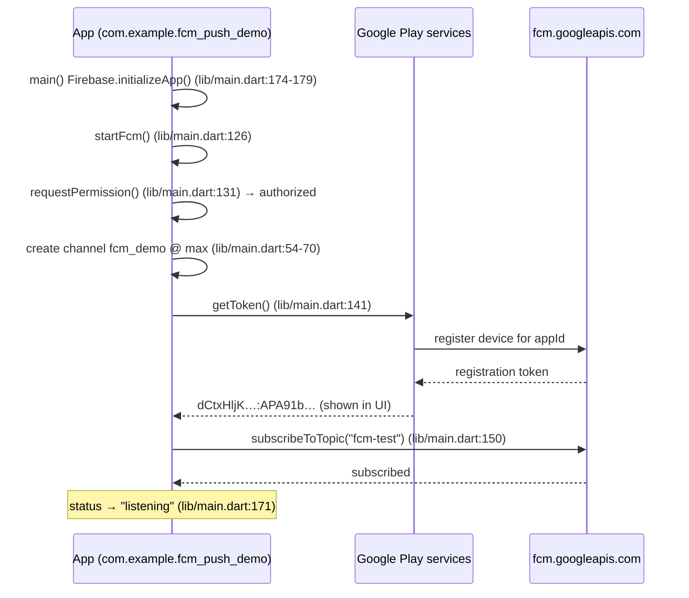
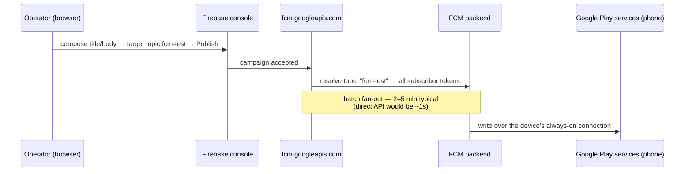
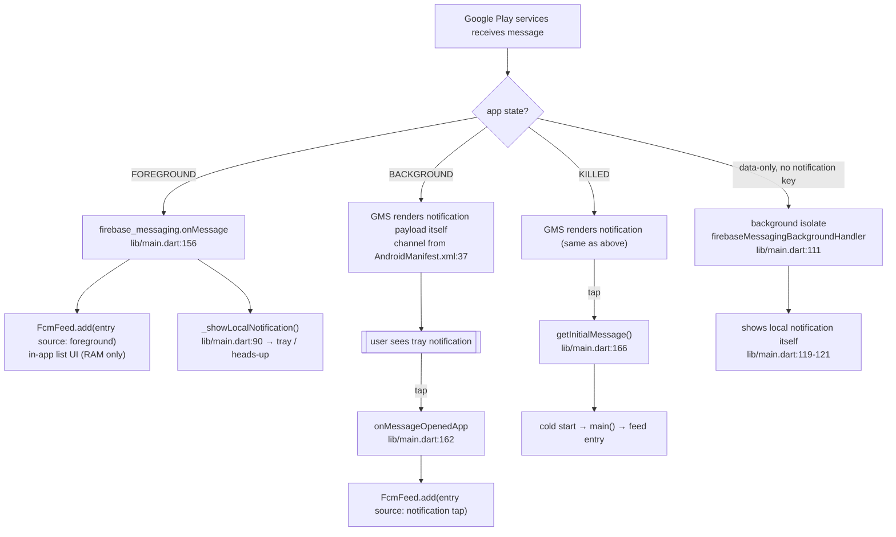

# FCM Push Notification Test Harness — System Map

Project: `/home/joyboy/PROJECTS/fcm_push_demo` (Flutter Android app, console-driven sending)
Firebase project: `fcm-test-demo8f2a` (project number `1063953542827`)
Android app id: `1:1063953542827:android:070089805397709b0151ee`
Package: `com.example.fcm_push_demo` · Topic: `fcm-test` · Channel: `fcm_demo`

> Companion to the original harness at `test/fcm_test` (package `com.example.fcm_test`).
> Difference: **no Python sender** — messages are sent manually from the Firebase console.

## 1. Who is who

| Actor | Machine | Role |
|---|---|---|
| **End user** | Android phone (SM-A515F, Android 13) | Reads the push in the system tray, or opens the app and reads the in-app log. Taps notifications to exercise launch paths. |
| **Operator / developer** | Linux workstation + browser | Clicks **Publish** in the Firebase console. That's the only input in the whole system. |
| **Google Play services (GMS)** | Phone, system process | Holds the always-on socket to Google. The only component that can make a notification appear when the app is not in the foreground. |
| **Google FCM backend** | `fcm.googleapis.com` | Accepts console campaigns / API calls, resolves topic→tokens, routes to devices. |
| **Firebase console** | `console.firebase.google.com` | Campaign composer + "Test on device" panel. Batch fan-out pipeline (latency: seconds to a few minutes). |

There is **no application server**. Sending is manual via the console. (The reference `sender.py` talked to `fcm.googleapis.com/v1` directly — ~1s latency vs campaign's 2–5 min.)

## 2. Where everything is stored

### On the developer's disk (static config — never changes at runtime)

| Path | Contents | Written by |
|---|---|---|
| `.firebaserc` | `{"projects":{"default":"fcm-test-demo8f2a"}}` | hand-written (Step 2) |
| `firebase.json` | projectId + appId + `fileOutput` per platform | `flutterfire configure` |
| `android/app/google-services.json` | `project_number`, `project_id`, `api_key` (non-secret, ships in every APK), `mobilesdk_app_id`, `package_name` — **merged into the APK at build time** by the google-services plugin | `flutterfire configure` |
| `lib/firebase_options.dart` | `apiKey`, `appId`, `messagingSenderId`, `projectId`, `storageBucket` — compiled into the Dart binary | `flutterfire configure` |
| `android/settings.gradle.kts:24` | `id("com.google.gms.google-services") version("4.4.4") apply false` | `flutterfire configure` |
| `android/app/build.gradle.kts:4` | `id("com.google.gms.google-services")` applied | `flutterfire configure` |
| `android/app/build.gradle.kts:18` | `isCoreLibraryDesugaringEnabled = true` (+ `:48` desugar_jdk_libs 2.1.4) — required by flutter_local_notifications | manual (Step 3) |

### On Google's side (cloud state)

| Store | Contents |
|---|---|
| Firebase project `fcm-test-demo8f2a` | Container for both app registrations (`fcm_test`, `fcm_push_demo`), API enablement, quotas |
| Registered Android app record | `package_name=com.example.fcm_push_demo` → appId. **This is why the app can get a token.** |
| Device registration tokens | Issued by FCM to the device, e.g. `dCtxHljKTyGEVd3MaQa7VT:APA91b…` |
| Topic subscription `fcm-test` | Server-side set of `{token ↔ topic}`. Created by `subscribeToTopic`; **nothing on disk records it** |
| Message log (FCM console) | Last 24h of campaigns + delivery stats |

### On the phone (runtime state)

| Store | Contents | Lifetime |
|---|---|---|
| GMS secure storage | This device's FCM registration token | until app uninstalled / token rotated |
| `NotificationManager` channel | `fcm_demo` (importance=5/max), created at runtime in `lib/main.dart:54-70`; default channel declared in `AndroidManifest.xml:37-39` | until app cleared |
| Notification records | posted notifications `pkg=com.example.fcm_push_demo` | until dismissed/tapped |
| `FcmFeed` (`lib/main.dart:30-46`) | `ValueNotifier`s: status, token, permission, topicStatus, messages — the in-app log | **RAM only — cleared on app restart. Nothing is persisted.** |
| Runtime permission | `POST_NOTIFICATIONS` (declared `AndroidManifest.xml:3`) | until revoked |

## 3. Network connections (every hop)

| # | From → To | Protocol | Purpose |
|---|---|---|---|
| 1 | Browser → Firebase console | HTTPS | operator composes a campaign (auth: your Google session) |
| 2 | Console → FCM backend | HTTPS (Google-internal) | hand over the campaign → fan-out pipeline (batch; seconds–minutes) |
| 3 | FCM backend → Google Play services (phone) | persistent long-lived connection to `mtalk.google.com` | push the message down to the device |
| 4 | GMS → `com.example.fcm_push_demo` | local binder / `com.google.android.c2dm.intent.RECEIVE` | deliver to the app, or render it directly |
| 5 | Flutter app → `NotificationManager` | local binder | post the tray notification (our foreground / data-only code path) |

**There is no connection between the console and the phone.** The phone's connection to Google is open 24/7; FCM just writes into it.

## 4. Sequence diagrams

### 4a. First launch (registration)



### 4b. Sending (console campaign)



### 4c. Receiving — the cases



## 5. The wire payload (what the console sends)

Conceptually identical to an FCM v1 `messages:send` body:

```json
{
  "message": {
    "notification": { "title": "T1 foreground", "body": "topic to foreground" },
    "data": { "sent_at": "…", "source": "console" },
    "android": {
      "priority": "high",
      "notification": { "channel_id": "fcm_demo", "sound": "default" }
    },
    "topic": "fcm-test"
  }
}
```

- `notification` → makes GMS draw it (works when app is background/killed)
- `data` → always delivered to Dart code (console: "Additional options")
- topic vs token → broadcast vs single device ("Test on device" tab)
- `priority: high` → bypasses Doze batching

## 6. Code → responsibility map

| Concern | Location |
|---|---|
| Constants `kTopic`/`kChannelId`/`kChannelName` | `lib/main.dart:10-12` |
| `PushEntry` model | `lib/main.dart:13-28` |
| In-memory store (`FcmFeed` + messages list) | `lib/main.dart:30-46` |
| Channel creation (importance max) | `lib/main.dart:54-70` |
| Message → entry mapping | `lib/main.dart:73-88` |
| Foreground tray renderer | `lib/main.dart:90-107` |
| Background isolate handler (data-only) | `lib/main.dart:111-122` |
| Boot: permission → channel → token → topic → listeners | `lib/main.dart:126-171` |
| Firebase boot | `lib/main.dart:174-179` |
| UI (status card + message log) | `lib/main.dart:181-322` |
| Permissions + default channel | `android/app/src/main/AndroidManifest.xml:2-3,37-39` |
| google-services plugin | `android/app/build.gradle.kts:4`, `android/settings.gradle.kts:24` |
| Application id | `android/app/build.gradle.kts:27` |
| Static Firebase config | `lib/firebase_options.dart:56-60` |
| Widget tests (3) | `test/widget_test.dart` |

## 7. Verified behaviour (live E2E, 2026-10-09, SM-A515F / Android 13)

| Case | Result |
|---|---|
| Boot | status `listening` · permission `authorized` · topic `subscribed (fcm-test)` · live token rendered |
| Topic campaign → foreground | feed entry `foreground · 21:41:52` + heads-up (T1) |
| Background → GMS render → tap | feed entry `notification tap · 21:26:49` |
| Killed (process death) → tap | cold-start feed entry via `getInitialMessage` |
| `flutter analyze` | clean · `flutter test` 3/3 · `flutter build apk --debug` ✓ |

## 8. Notable properties / gotchas

1. **No persistence** — the in-app message list is RAM-only (`FcmFeed`); restart clears it.
2. **No app server** — sends are manual console campaigns; latency is batch-level (2–5 min), not the ~1s a direct `messages:send` API call would give.
3. **Two renderers** — foreground: our Dart code draws the notification; background/killed: GMS draws it. Same channel `fcm_demo` both ways, so it looks identical.
4. **Topic vs token** — topic membership lives only in Google's cloud; nothing on disk records it. Topic `fcm-test` is shared with the companion `com.example.fcm_test` app — one campaign reaches both.
5. **Token is per-install** — it rotates; `onTokenRefresh` (`lib/main.dart:145`) keeps the UI current.
6. **FCM v1 only** — legacy HTTP API is dead; campaigns go through `fcm.googleapis.com/v1`.
7. **Force-stop ≠ killed** — `am force-stop` (or Settings → Force stop) sets Android's **stopped state**: the package receives **no broadcasts at all**, so FCM delivers nothing until the app is manually launched once. The "killed" test must use process death (swipe-away / `am kill`), not force-stop.
8. **Security note** — the Android `apiKey` in `google-services.json`/`firebase_options.dart` is not a secret (it ships in every APK; Firebase docs). Real sending authority is the OAuth refresh token in `~/.config/configstore/firebase-tools.json` — outside this repo, never committed.
