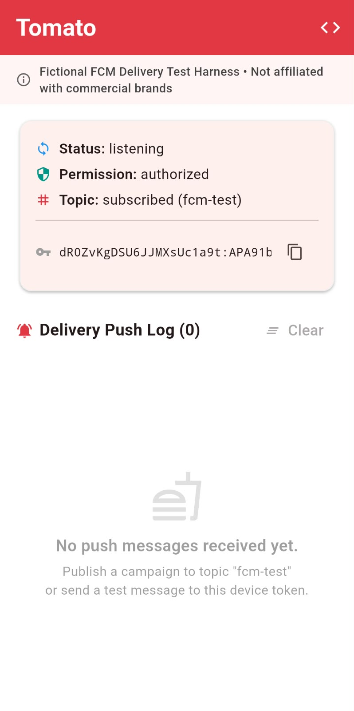
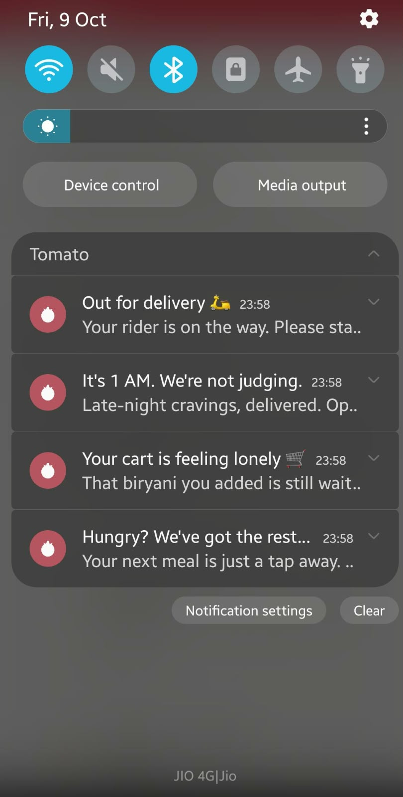
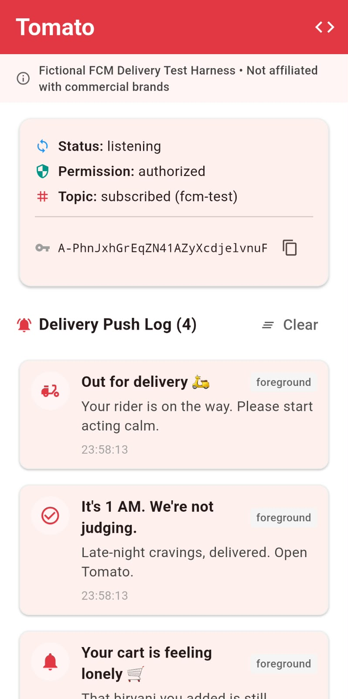
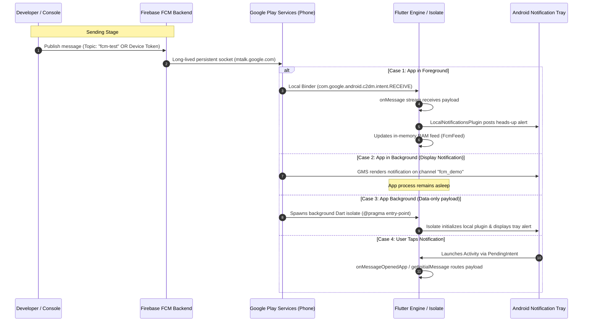

# Firebase Cloud Messaging (FCM) Production Test Harness

[](https://flutter.dev)
[](https://firebase.google.com/docs/cloud-messaging)
[-3DDC84?logo=android&logoColor=white)](https://developer.android.com)
[](LICENSE)

An end-to-end, deterministic mobile push notification test harness built with **Flutter** and **Firebase Cloud Messaging (FCM)**. This project models a mission-critical, time-sensitive food-delivery scenario—internally branded as **"Tomato 🍅"**—to rigorously validate and benchmark cloud-to-device push notification delivery across all application lifecycle states.

---

> [!NOTE]
> **Fictional Demonstration Disclaimer**
> 
> **"Tomato"** is an entirely fictional demo brand and test scenario created exclusively for benchmarking mobile push notification architectures. It is **not affiliated with, sponsored by, or endorsed by Zomato, Swiggy, or any commercial entity**. All sample payloads represent sanitized, synthetic delivery milestones.

---

## 🖼️ Live Demo

A 4-message marketing broadcast to topic `fcm-test` via the FCM HTTP v1 API, captured on a physical Android 13 device (all accepted by FCM in ~1s each, delivered at 23:58).

| Before | System tray (all 4 delivered) | In-app feed (icons matched) |
|:---:|:---:|:---:|
|  |  |  |

The tray shows the Tomato stat icon on every entry; the in-app log demonstrates the heuristic icon mapping (🛵 delivery, ✓ delivered, 🔔 default) and per-message `foreground` source attribution.

---

## 🎯 What This Project Demonstrates

Reliable mobile push delivery in modern operating systems is non-trivial due to aggressive OS battery optimization, background execution limits, and notification permission changes. This repository provides a reference implementation addressing the core engineering challenges:

1. **Deterministic Three-State Push Handling**:
   - **Foreground**: FCM SDK suppresses native system trays while the app is active. We bridge incoming payloads directly to `flutter_local_notifications` on a designated high-priority channel.
   - **Background**: Google Play services (GMS) intercepts standard notification payloads directly from the persistent `mtalk.google.com` socket and renders to the system tray.
   - **Terminated (Killed Process)**: Verifies cold-boot app launch intents via `FirebaseMessaging.instance.getInitialMessage()` to support deep-linking from dismissed states.
2. **Dual Sending Topologies**:
   - **Topic-Based Pub/Sub (`fcm-test`)**: Simulates broadcast notifications (e.g., regional delivery updates, promotional campaigns) routed server-side by Google's backend.
   - **Direct Device Token Targeting**: Simulates transactional, user-specific notifications (e.g., order confirmed, driver at your door).
3. **Android 13+ (`API 33`) Permission Model**:
   - Seamless runtime request for `POST_NOTIFICATIONS` with explicit authorization state tracking.
4. **Custom Notification Channel & Heads-Up Tray Alerts**:
   - Configures Android notification channels at `Importance.max` (`IMPORTANCE_HIGH`) to ensure high-visibility heads-up alerts with custom brand accents and icons.
5. **Background Isolate Architecture for Data-Only Payloads**:
   - Top-level `@pragma('vm:entry-point')` handler ensuring silent data messages wake background isolates without crashing when UI threads are suspended.

---

## 🏗️ Architecture & Message Flow



---

## 📱 The "Tomato 🍅" Scenario & Sample Payloads

To mirror real-world latency and priority requirements, notifications follow progressive stages of an order lifecycle:

```
[Order Placed] ──▶ [Kitchen Prep] ──▶ [Out for Delivery] ──▶ [Delivered]
   (Standard)          (Low latency)        (High priority)     (Deep-linkable)
```

### 1. Order Confirmation (Topic Broadcast)
```json
{
  "message": {
    "topic": "fcm-test",
    "notification": {
      "title": "Order Placed 🍕",
      "body": "Your order #8102 is confirmed. The kitchen is preparing your meal."
    },
    "data": {
      "order_id": "8102",
      "status": "confirmed"
    }
  }
}
```

### 2. High-Priority Out for Delivery (Direct Token)
```json
{
  "message": {
    "token": "YOUR_DEVICE_REGISTRATION_TOKEN",
    "notification": {
      "title": "Out for Delivery 🛵",
      "body": "Your delivery partner is on the way. Estimated arrival: 12 mins."
    },
    "android": {
      "priority": "HIGH",
      "notification": {
        "channel_id": "fcm_demo",
        "notification_priority": "PRIORITY_MAX",
        "default_sound": true,
        "default_vibrate_timings": true
      }
    },
    "data": {
      "order_id": "8102",
      "status": "in_transit",
      "eta_minutes": "12"
    }
  }
}
```

### 3. Silent Tracking Update (Background Isolate Test)
```json
{
  "message": {
    "topic": "fcm-test",
    "data": {
      "title": "Delivery Arrived 🎉",
      "body": "Your driver has arrived at your address. Enjoy your meal!",
      "order_id": "8102",
      "status": "arrived"
    }
  }
}
```

---

## 🧪 Quickstart & Testing Runbook

### Prerequisites
- Flutter SDK `^3.10.0` or later
- Android device or emulator with Google Play Services (API Level 26+)
- A Firebase project with FCM enabled (`google-services.json` placed in `android/app/`)

### Setup & Run
```bash
# 1. Clone repository
git clone https://github.com/hariraja-07/fcm-push-demo.git
cd fcm-push-demo

# 2. Install dependencies
flutter pub get

# 3. Connect target Android device and launch
flutter run
```

### Triggering Tests via Firebase Console
1. Open the [Firebase Console](https://console.firebase.google.com) and navigate to **Engage > Messaging**.
2. Click **New Campaign** > **Notifications**.
3. Enter title: `Out for Delivery 🛵` and text: `Arriving in 10 mins`.
4. Target:
   - To test **Topics**: select Topic `fcm-test`.
   - To test **Direct Send**: click **Send test message**, paste the device registration token displayed in the app UI, and click **Test**.
5. Observe tray delivery behavior across Foreground, Background (press Home), and Killed (swipe app away from recents).

---

## 📊 Lifecycle Verification Matrix

| Lifecycle State | Message Type | Delivery Engine | Tray Alert | In-App Feed |
|---|---|---|:---:|:---:|
| **Foreground** | Notification + Data | Flutter `onMessage` | ✅ (via LocalNotifications) | ✅ Live updated |
| **Background** | Notification | Google Play Services | ✅ (via GMS) | On app open |
| **Background** | Data-Only | Background Isolate | ✅ (via LocalNotifications) | On app open |
| **Terminated (Killed)** | Notification | Google Play Services | ✅ (via GMS) | On launch (`getInitialMessage`) |

---

## 📂 Repository Structure

```
├── android/
│   ├── app/
│   │   ├── build.gradle.kts       # Core library desugaring & GMS plugin
│   │   └── src/main/
│   │       ├── AndroidManifest.xml # POST_NOTIFICATIONS, default channel & icons
│   │       └── res/               # Tomato launcher mipmaps & tray drawables
├── doc/
│   └── assets/
│       ├── *.svg / tomato_icon.png# Tomato brand assets
│       └── screenshots/           # Live broadcast captures (tray + feed)
├── lib/
│   ├── firebase_options.dart      # Platform credentials generated via FlutterFire
│   └── main.dart                  # Foreground listener, background isolate & Tomato UI
├── ARCHITECTURE.md                # Comprehensive hop-by-hop system architecture map
├── LINKEDIN_CONTENT.md            # Ready-to-publish social showcase & carousel copy
├── LICENSE                        # MIT Open Source License
└── README.md
```

---

## 🔒 Security & Best Practices

- **Zero Credentials Committed**: Device tokens and server secrets are never hardcoded or tracked in Git.
- **Client-Side Token Protection**: Registration tokens are kept in volatile memory and can be copied on-device for authorized diagnostic testing only.
- **Java 8+ Desugaring**: Enabled via `isCoreLibraryDesugaringEnabled = true` to support modern Java time and notification APIs across older Android runtimes.

---

## 📄 License

This project is licensed under the [MIT License](LICENSE).
